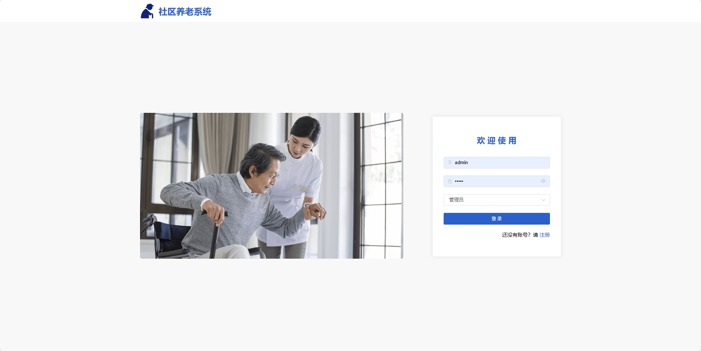
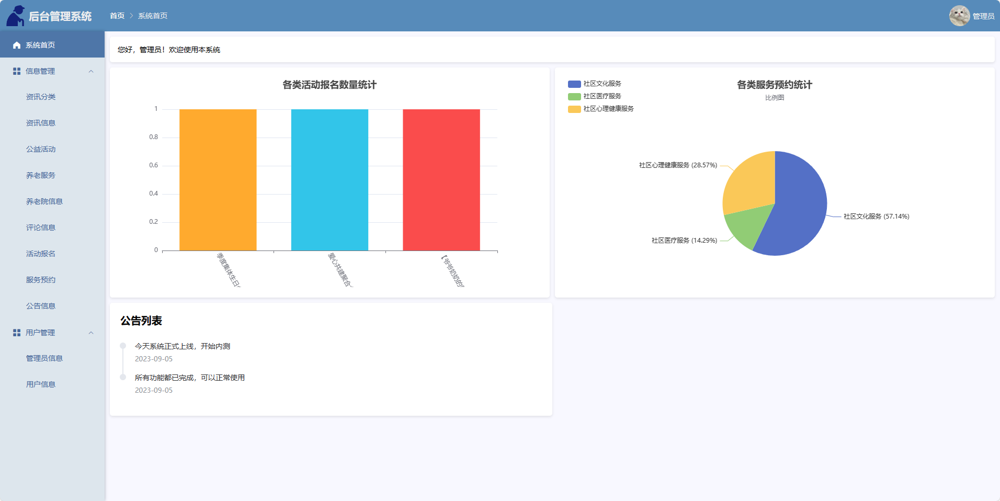
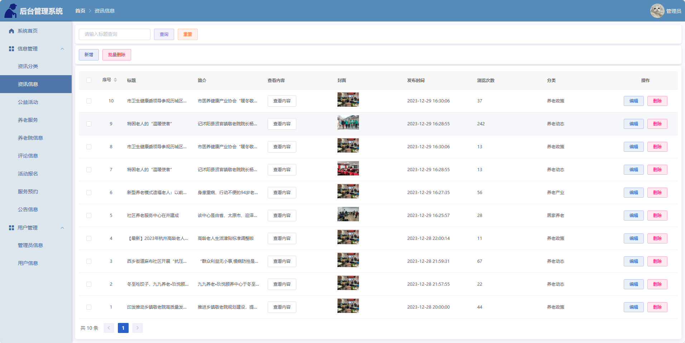
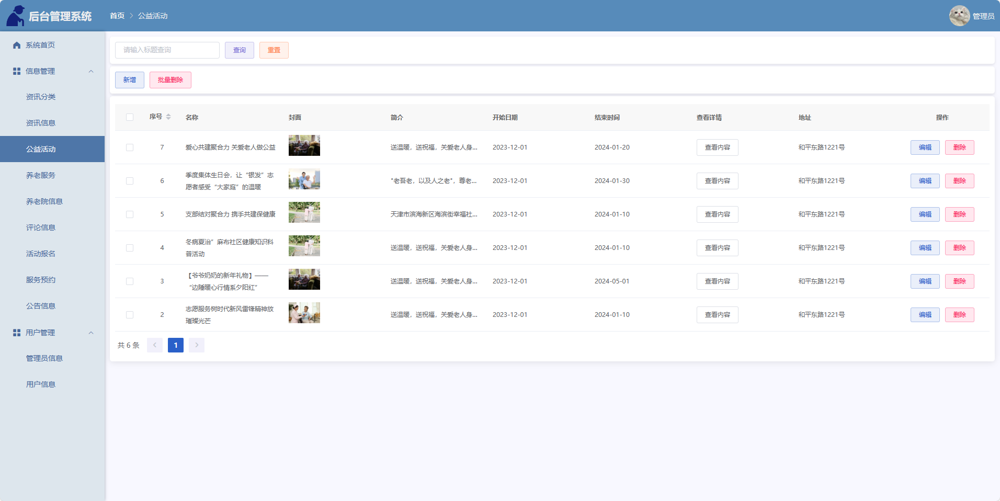
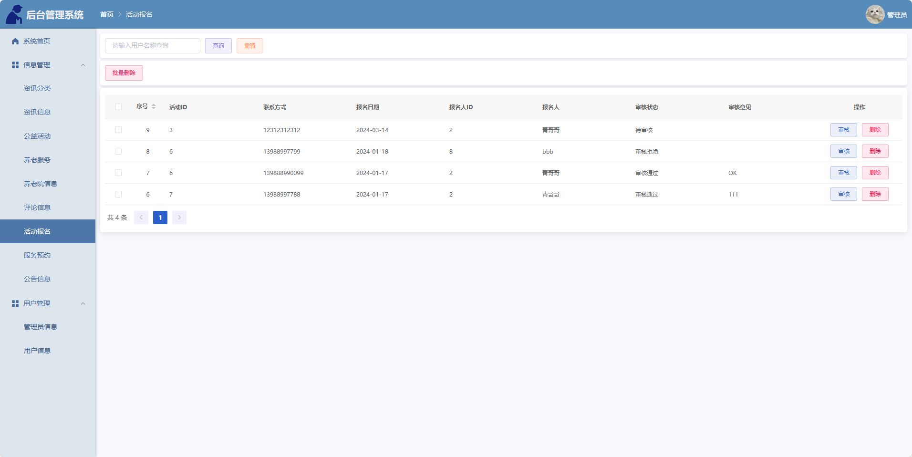
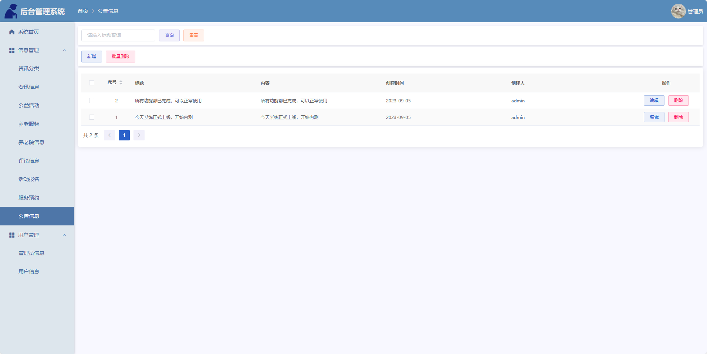
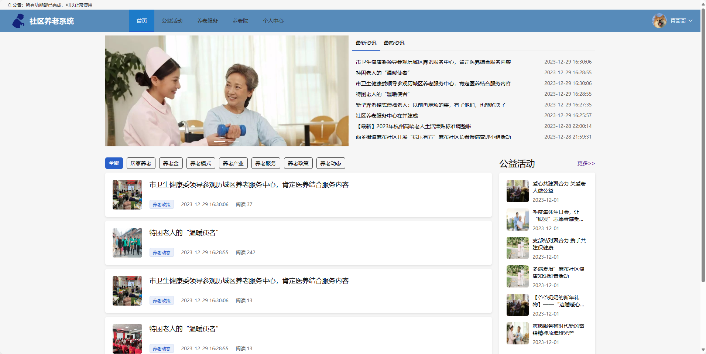
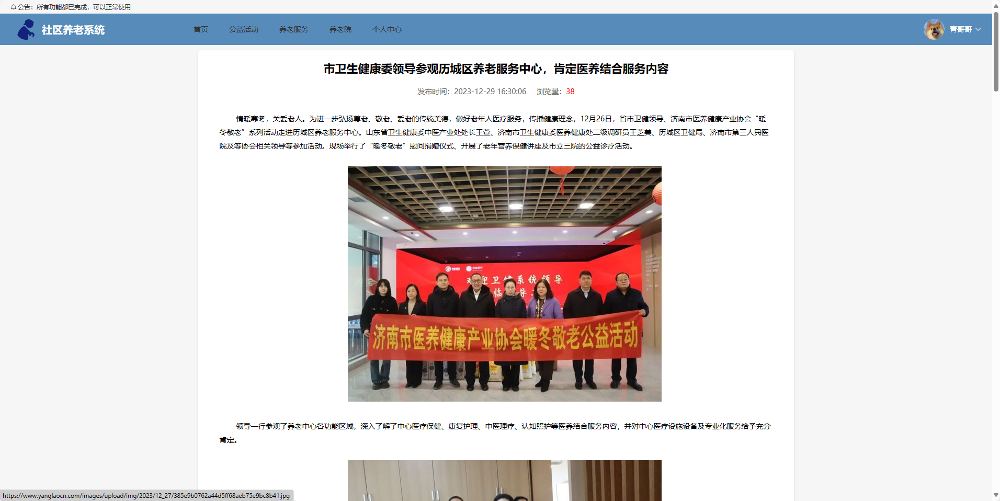
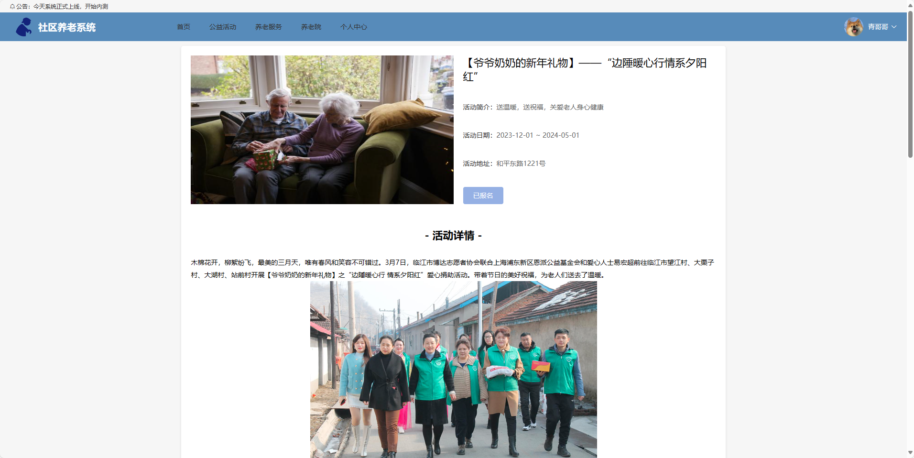

## 接毕业设计和论文

### 作者QQ：374556841 微信：zhiang0730 (支持修改、 部署调试、 支持代做毕设)

### 接网站建设、小程序、H5、APP、各种系统等

### 选题+开题报告+任务书+程序定制+安装调试+论文+答辩ppt  都可以做
### 下面是部分系统 后续会上传部分代码及系统角色用例图及演示视频

<h1 align="center">009.社区养老系统</h1>

	
    
    

## 简介

> 本代码来源于网络,仅供学习参考使用,请入群(123300273)后联系群主索要sql文件!
>
> 提供1.远程部署/2.修改代码/3.设计文档指导/4.框架代码讲解等服务
>
> 前端首页: http://localhost:8080/login
>
> 用户: 用户名: aaa 密码: 123
>
> 管理员: 用户名: admin 密码: admin
> 
> 1、项目功能描述
> 管理员角色：
> 登录、个人信息管理、修改密码
> 
> 资讯分类管理、资讯管理、公益活动管理、活动报名管理
> 
> 养老服务管理、服务预约管理、养老院管理、评论管理
> 
> 公告管理、管理员管理、用户管理
> 
> 首页统计图表（柱状图和饼图）
> 
> 用户角色：
> 登录、注册
> 
> 首页：轮播图、浏览最新最热资讯、浏览分类资讯、展示热门公益活动
> 
> 公益活动：浏览活动列表、浏览活动详情、评论活动、报名活动
> 
> 养老服务：浏览服务列表、预约服务
> 
> 养老院：浏览养老院列表、浏览养老院详情、查看养老院百度地图
> 
> 公告查看
> 
> 个人信息管理、修改密码
> 
> 我的：我报名的活动（查看、取消）、我预约的服务（查看、取消）
> 
> 2、项目技术栈
> 后端：Springboot + Mybatis
> 
> 前端：Vue + ElementUI
> 
> 数据库： Mysql
> 
> 模式：前后端分离

## 环境

- <b>IntelliJ IDEA 2021.3</b>

- <b>Mysql 5.7.26</b>

- <b>Tomcat 7.0.73</b>

- <b>JDK 1.8</b>

## 缩略图

## License

# [更多论文: 全目录查看](https://github.com/ZhiangChen0730/graduationDesign)
